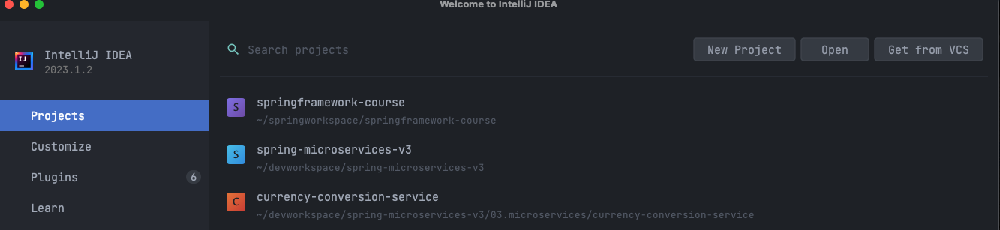
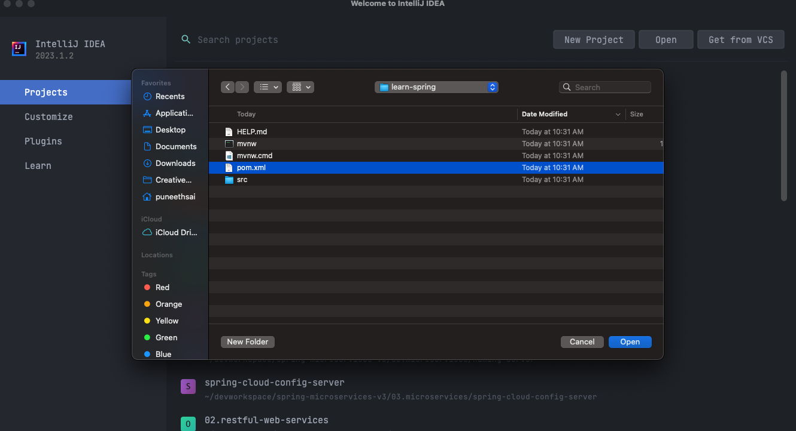
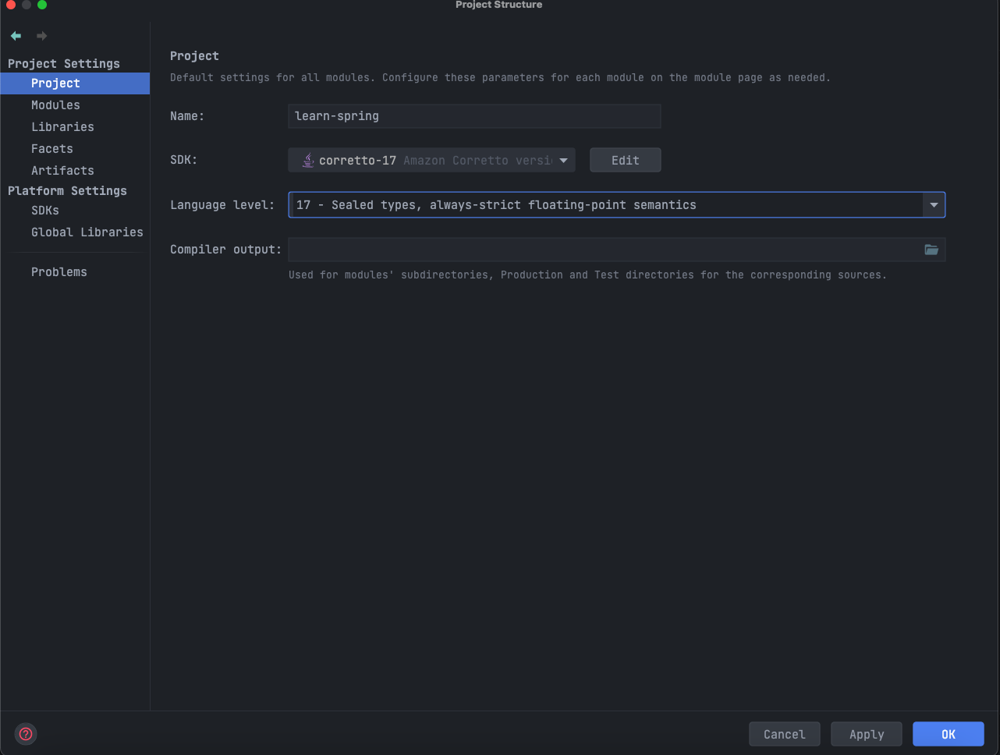
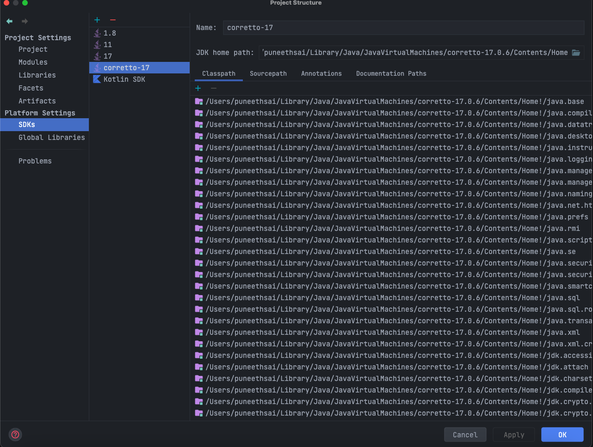
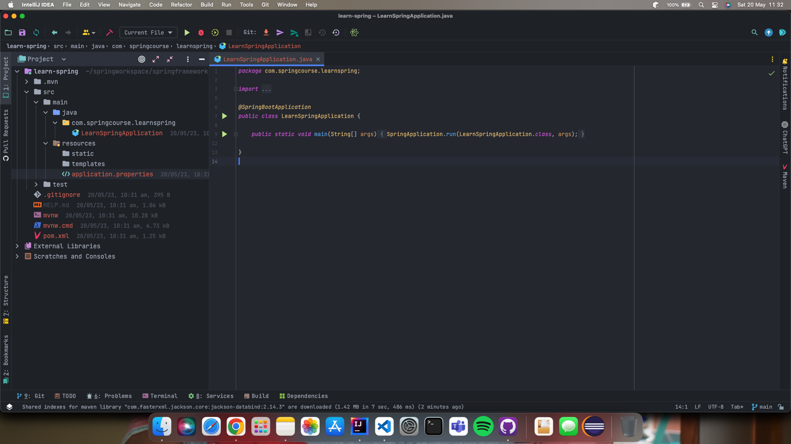
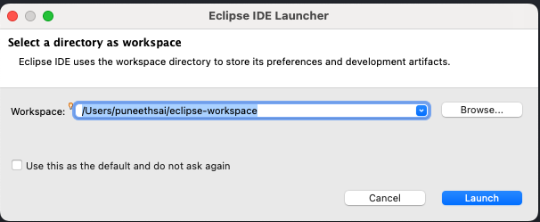
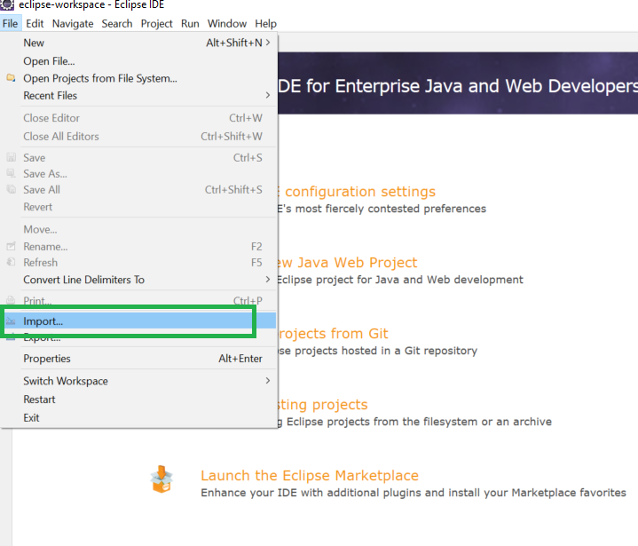
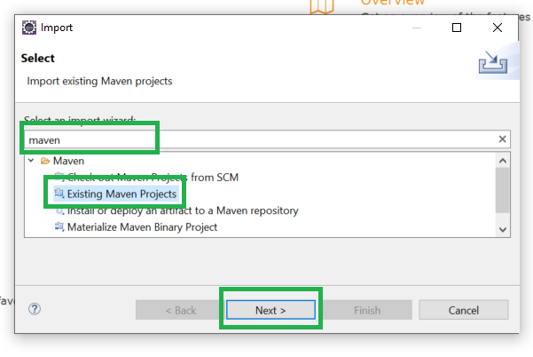
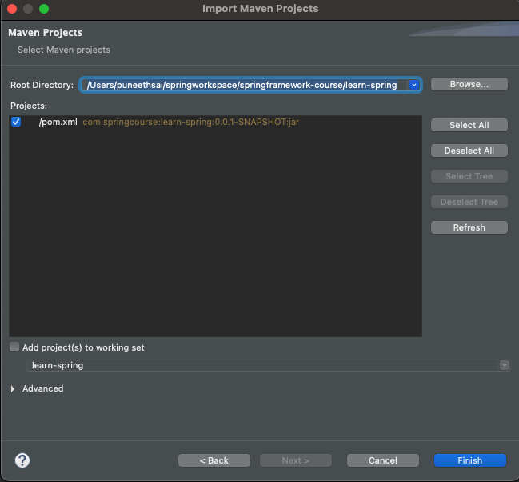
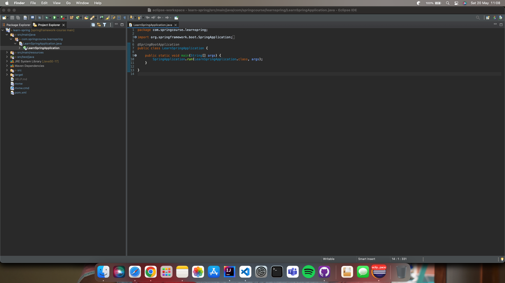

## Steps for Running Sample Project in Local WorkStation
- Download the zip from [here](https://github.com/bsmahi/springframework-course/blob/main/learn-spring.zip) or clone the Git repository from [here](https://github.com/bsmahi/springframework-course/tree/6bb42d20b052cddeb4dc5a6a6919e348a6e8fd4e/learn-spring).
- Unzip the zip file (if you downloaded one)
- Open Command Prompt and Change directory (cd) to folder containing pom.xml
- Open either IntelliJ or Eclipse
  - Follow these [steps](https://github.com/bsmahi/springframework-course/blob/main/LocalDevelopmentSteps.md#1-create-a-spring-boot-project-in-intellij-idea) for IntelliJ
  - Follow these [steps](https://github.com/bsmahi/springframework-course/blob/main/LocalDevelopmentSteps.md#1-create-a-spring-boot-project-in-intellij-idea) for Eclipse 
- Choose the Spring Boot Main Application file and run the application
- You are all Set

# OR

## Create a Spring Boot Project using Spring Initializr for any Development IDE
- Setting up a Spring Project using spring initializr http://start.spring.io
  
  In the above image, please select the following options
- Project as `Maven` or `Gradle`
- Language as `Java` or `Kotlin`
- Spring Boot Version as `3.0.7` or _**latest one**_
- Project Metadata as
  - Group as `com.springcourse`
  - Artifact as `learn-spring`
  - Name as `learn-spring`
  - Description can be your choice
  - Package name automatically generate by the tool based on **Group, Artifact**
  - Packaging as `jar`
  - Java version as `17` for now
  - Type "web" into the search box, and we'll obtain **Spring Web** and add it
  - Click the **"Generate"** button to create a project zip file with the basic spring boot application structure

# 1. Create a Spring Boot Project in IntelliJ IDEA

The IntelliJ integrated development environment (IDE) is a Java-based program.

# **Steps:**

1. Install Intellij IDEA in Local Machine
2. Launch Intellij and Click **"Open"** and Navigate to the folder containing the spring boot project
3. Inside folder select **"pom.xml"** and click on "Open" Button
4. Since we are working on JDK 17, after importing the project we need to perform we need to select correct JDK version

## Step 1: Installation of IntelliJ IDE

- Install IntelliJ IDE by going through [Tools & Prerequisites](ToolsForTheCourse.md)

## Step 2: Import Spring Boot Project in IntelliJ IDE

## Step 3: Inside folder select **"pom.xml"** and click on "Open" Button

## Step 4: Since we are working JDK 17, after importing the project, we need to select the correct JDK version
- File > Project Structure > **Project Settings** select as per the below screen
  
- File > Project Structure > **Platform Settings** select as per the below screen
  

The Spring Boot project has now been completed, as shown in the image below. The Project file structure is shown on the left side, while the Code Editor is shown in the middle.

# 2. Create Spring Boot Basic Application in Eclipse IDE

The Java Integrated Development Environment (IDE) is well-known in the Eclipse IDE.

# **Steps:**

1. Install Eclipse IDE for **Enterprise Java and Web Developer**
2. Import Spring Boot Project in Eclipse IDE.
3. Search for "maven" and Choose Existing Maven Project.
4. Choose **Next**.
5. Click on the **Browse** button and select the extracted zip.
6. Click on the **Finish** button, and we are done with the importing the spring boot project.

## Step 1: Installation of Eclipse IDE

- Install Eclipse IDE by going through [Tools & Prerequisites](ToolsForTheCourse.md)

## Step 2: Import Spring Boot Project in Eclipse IDE

- Open Eclipse
    - File -> Import -> Existing Maven Project -> Navigate to the folder where you unzipped the zip
    - Select the right project

## Step 3 & 4: Search for "maven" and Choose Existing Maven Project and Choose **Next** button

## Step 5: Now click on the **Browse** button and navigate to the folder containing the unzipped spring boot project

## Step 6: Click on the **Finish** button, and we are done with the importing the spring boot project.
> The Spring Boot project has now been completed, as shown in the image below.

#### Happy Coding 