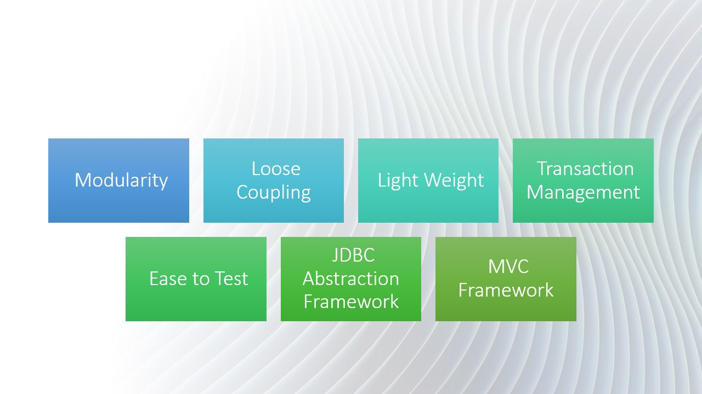

# Advantages of SpringFramework

The following are the advantages of the Spring framework:

### 1. Modularity

> Spring is a versatile framework that gives developers modularity. Spring framework includes several modules for developing sophisticated applications, including Spring Core Container, Spring AOP, Spring Test, Spring IoC, Spring MVC, Spring ORM, Spring OXM, and Spring Transactions.

### 2. Loose Coupling

> Spring achieves loose coupling using a key feature called Dependency Injection (DI) and an IoC container (Inversion of Control). Dependency Injection maintains Java classes independent of one another in order to achieve loose coupling.

### 3. Light Weight

> Spring is a simple framework. It also allows developers to utilise any of its modules on a use case basis. It supports POJO applications, making Spring framework lighter.

### 4. Transaction Management

> Spring framework provides a consistent abstraction layer for accessing transaction services from a variety of contexts, including JTA, JDBC, JPA, and Hibernate. It also provides declarative transaction services in the same way as Java EE and EJB do.

### 5. Easy to Test

> Because of dependency injection, Spring makes application testing easy. Spring employs POJOs in the JavaBean paradigm, which simplifies the insertion of test data.

### 6. JDBC Abstraction Framework

> The Spring framework has an abstraction layer that may be used to tackle issues like code duplication, resource management, and exception handling.

### 7. MVC Framework

> Spring's web framework is an appealing Web-MVC framework that facilitates the building of Java web applications. It is also very flexible and supports a variety of display technologies like JSP, Tiles, and others.