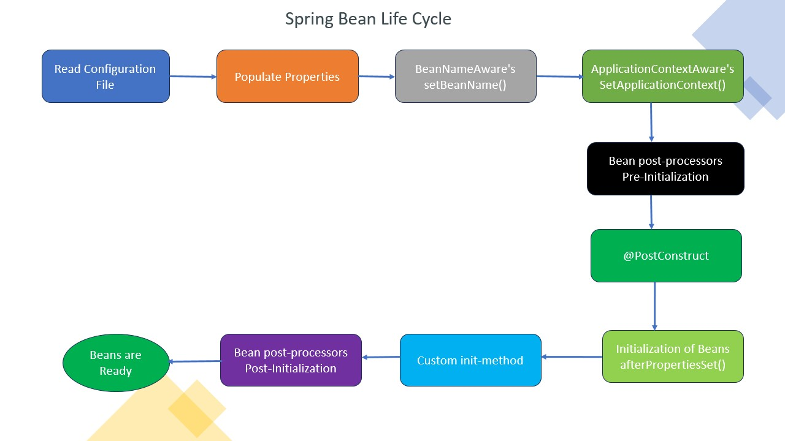

# Spring Bean Life Cycle 

Beans are objects controlled by the Spring IoC (Inversion of Control) container in the context of the Spring framework. In Spring, a bean's lifetime refers to the different steps it goes through, from instantiation to destruction.

The spring bean’s life cycle is as shown below

1. The spring container looks for the **bean** definition in the spring configuration xml file or config file.
2. Spring **instantiates** the bean by calling the no-argument default constructor of that class. If the class only has **parameterized constructors**, the bean must be defined in the spring xml file with **constructor injection**, otherwise the container will throw a bean creation exception. Spring injects the values and references if any into bean’s properties.
3. Spring gives the bean's ID to the **setBeanName()** function and performs this method if the bean implements the **BeanNameAware** interface.
4. If the bean implements the **ApplicationContextAware** interface, Spring will call the **setApplicationContext()** method and execute it, handing in a reference to the current application context.
5. Spring invokes their **postProcessBeforeInitialization()** function if the bean implements the **BeanPostProcessor** interface.
6. If the bean implements the **InitializingBean** interface, Spring invokes the **afterPropertiesSet()** method after all the bean's properties have been set.
   Similarly, if the bean is defined with an **init-method**, the initialization method indicated will be called.
7. Spring will invoke their **postProcessAfterInitialization()** function if the bean implements **BeanPostProcessor**.
8. At this point, the bean is ready to be used by the application and will remain in the application context until the application context is destroyed.
9. If the bean implements the **DisposableBean** interface, then Spring will call the **destroy()** method. Likewise, if any bean was declared with a destroy-method, then the specified method will be called.