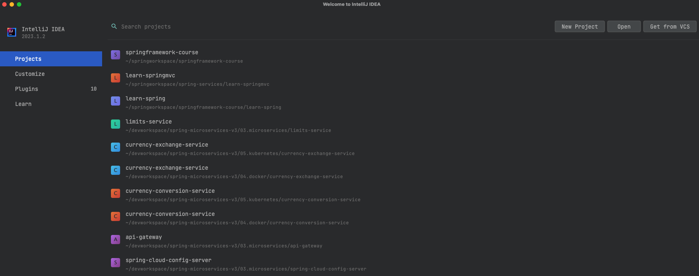
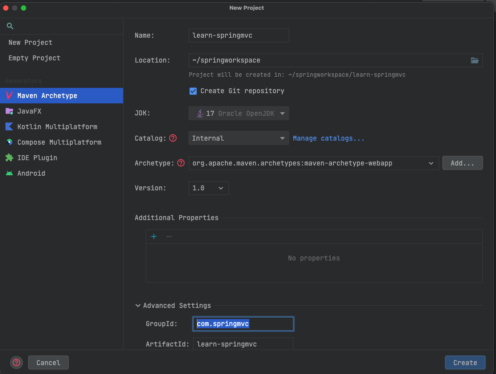
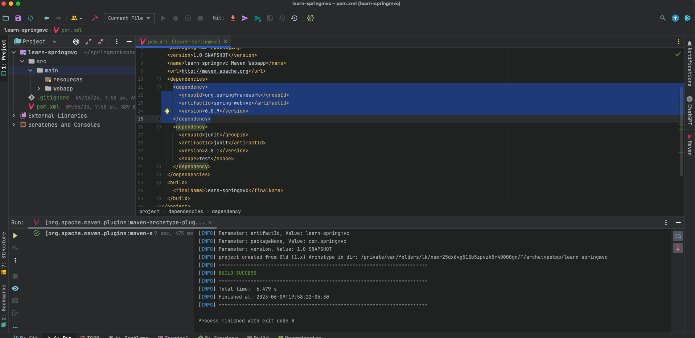
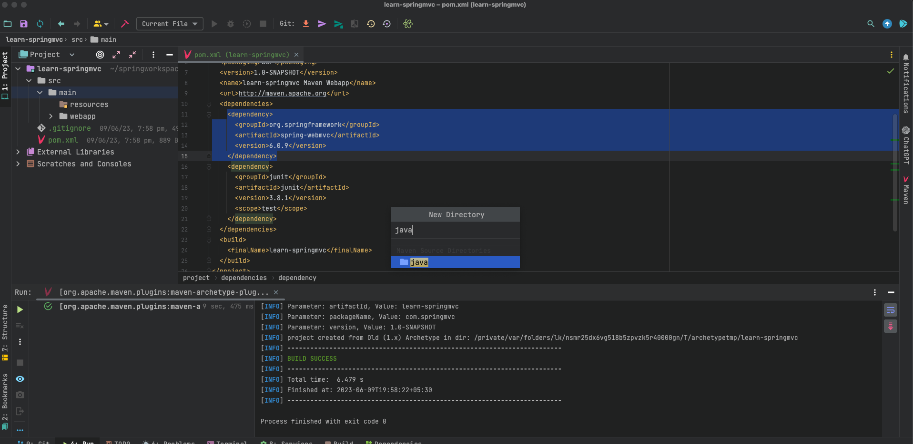
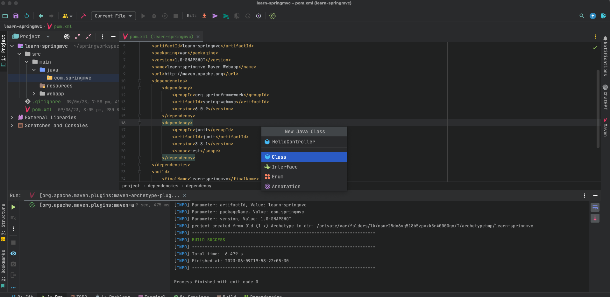

# Create Spring MVC Project

We may construct a Spring MVC project in two methods.

## Manual Configuration:
   
If you prefer a more hands-on approach, you can manually construct a Spring MVC project by specifying the essential components and setting up the project structure. 
Typically, you would begin by creating a new **Maven** or **Gradle** project and adding the appropriate **Spring MVC dependencies**.
The **Spring DispatcherServlet** would then be configured, **controllers** would be created, **views** (templates or JSPs) defined, and any extra components (e.g., data access, security) would be set up.
This method allows greater flexibility and control over project settings, but it necessitates a better grasp of Spring MVC's internals. 

Configure a Spring MVC project by following these steps in IntelliJ

1. Open your **IntelliJ IDEA** and click on a new project.

   

2. Choose Maven ArcheType from the left and then check Create from archetype. Search for `org.apache.maven.archetypes.maven-archetype-webapp` and fill the details with your project and Click the **Create** Button
    * Name: **learn-springmvc**
    * GroupId : **com.springmvc**
    * ArtifactId: **learn-springmvc**

   

3. Wait for a project to open in IDE, and Include the following dependent in your `pom.xml` file's dependencies

    ```xml
    <dependency>
      <groupId>org.springframework</groupId>
      <artifactId>spring-webmvc</artifactId>
      <version>6.0.9</version>
    </dependency>
    ```   

   

   
4. Click on the **Maven** tab on the right and click on the sync button to reload the `pox.xml`.

5. Create two new folders in the main folder, **java** and **resources**, as seen in the screenshot below. We shall keep all *.java files in java and all static resources in resources.
   

6. Create a new class in java directory `com.springmvc.HelloController`, Here **com.springmvc** is the name of the base-package and HelloController is the name of our class.
   
7. Create a new directory called jsp inside **WEB-INF** directory (assuming you're using jsp as the template engine). For this example, let's create a file named `hello.jsp`.
```html
   <!DOCTYPE html>
   <html>
   <head>
       <title>Spring MVC Demo</title>
   </head>
   <body>
       <h2>${message}</h2>
   </body>
   </html>
```
8. Create a new file named `web.xml` within the **WEB-INF** directory and update its contents as seen in the screenshot below.
      ```xml
      <?xml version="1.0" encoding="UTF-8"?>
         <web-app xmlns="http://java.sun.com/xml/ns/javaee"
                  xmlns:xsi="http://www.w3.org/2001/XMLSchema-instance"
                  xsi:schemeLocation="
                             http://java.sun.com/xml/ns/javaee
                             http://java.sun.com/xml/ns/javaee/web-app_3_0.xsd">
         
           <display-name>Spring MVC Application</display-name>
         
           <!-- Step 1: Configure Spring MVC Dispatcher Servlet -->
           <servlet>
             <servlet-name>dispatcher</servlet-name>
             <servlet-class>org.springframework.web.servlet.DispatcherServlet</servlet-class>
             <init-param>
               <param-name>contextConfigLocation</param-name>
               <param-value>/WEB-INF/helloweb-servlet.xml</param-value>
             </init-param>
             <load-on-startup>1</load-on-startup>
           </servlet>
         
           <!-- Step 2: Set up URL mapping for Spring MVC Dispatcher Servlet -->
           <servlet-mapping>
             <servlet-name>dispatcher</servlet-name>
             <url-pattern>/</url-pattern>
           </servlet-mapping>
         
         </web-app>
      ```
9. Make a new file named `helloweb-servlet.xml` and edit its contents as seen in the screenshot below.
```xml
<?xml version="1.0" encoding="UTF-8"?>
<beans xmlns="http://www.springframework.org/schema/beans"
       xmlns:xsi="http://www.w3.org/2001/XMLSchema-instance"
       xmlns:context="http://www.springframework.org/schema/context"
       xmlns:mvc="http://www.springframework.org/schema/mvc"
       xsi:schemaLocation="
      http://www.springframework.org/schema/beans
       http://www.springframework.org/schema/beans/spring-beans.xsd
       http://www.springframework.org/schema/context
       http://www.springframework.org/schema/context/spring-context.xsd
       http://www.springframework.org/schema/mvc
        http://www.springframework.org/schema/mvc/spring-mvc.xsd">

    <!-- Change the name of the package to your base-package -->
    <context:component-scan base-package="com.springmvc"/>
    <mvc:annotation-driven/>

    <bean class="org.springframework.web.servlet.view.InternalResourceViewResolver">
        <property name="prefix" value="/WEB-INF/jsp/"/>
        <property name="suffix" value=".html" />
    </bean>

</beans>
```

10. Install the Smart Tomcat plugin
11. Click on the Add Configuration button and then click on + button. Select Smart Tomcat and click OK
12. Download the [Apache Tomcat](https://dlcdn.apache.org/tomcat/tomcat-10/v10.1.9/bin/apache-tomcat-10.1.9.zip) and extract the compressed download.


## Using Spring Initializr

Spring Initializr is a web-based application that the Spring team provides to construct a pre-configured Spring project structure. It lets you choose the dependencies and technologies to integrate in your project, such as Spring MVC, database drivers, security, and so on. After selecting the required choices, you may download the project structure as a zip file and import it into your favourite integrated development environment (IDE).
Spring MVC autoconfiguration in a Spring Boot application is extremely simple because Spring Boot supports autoconfiguration for Spring MVC. 

To create a Spring MVC application using Spring Boot, follow these steps:

## Step 1: Set up a new Spring Boot project 
Create a new Maven or Gradle project and add the necessary dependencies for Spring Boot and Spring MVC. In this example, I'll use Maven.

Add the following dependencies to your `pom.xml` file:

```xml
<dependencies>
    <!-- Spring Boot Starter -->
    <dependency>
        <groupId>org.springframework.boot</groupId>
        <artifactId>spring-boot-starter-web</artifactId>
    </dependency>

    <!-- Thymeleaf Template Engine (optional) -->
    <dependency>
        <groupId>org.springframework.boot</groupId>
        <artifactId>spring-boot-starter-thymeleaf</artifactId>
    </dependency>
</dependencies>

```
## Step 2: Create a Controller
Make a new Java class that will act as a controller for your Spring MVC application. This class is responsible for handling incoming HTTP requests and defining the application's endpoints.

```java
package com.springcourse.learnspring.springmvc;

import org.springframework.stereotype.Controller;
import org.springframework.ui.Model;
import org.springframework.web.bind.annotation.GetMapping;

@Controller
public class HelloController {

    @GetMapping("/")
    public String helloWorld(Model model) {
        model.addAttribute("message", "Welcome to Spring MVC!");
        return "hello";
    }
}

```

## Step3: Create a View

Create a new HTML view file in the **/src/main/resources/templates** directory (assuming you're using Thymeleaf as the template engine). For this example, let's create a file named `hello.html`.

```html
<!DOCTYPE html>
<html lang="en">
<head>
    <meta charset="UTF-8">
    <title>Spring MVC Example</title>
</head>
<body>
<h1>Spring MVC Example</h1>
<p th:text="${message}"></p>
</body>
</html>
```

## Step 4: Run the Application
You may now launch your Spring Boot application i.e., **LearnSpringApplication**. Spring Boot will manage the startup of the embedded Tomcat server as well as the deployment of your application.

```java
package com.springcourse.learnspring;

import org.springframework.boot.SpringApplication;
import org.springframework.boot.autoconfigure.SpringBootApplication;

@SpringBootApplication
public class LearnSpringApplication {

	public static void main(String[] args) {
		SpringApplication.run(LearnSpringApplication.class, args);
	}

}
```
## Step 5: Test the Application
Open your web browser and visit http://localhost:8080 (assuming the application is running on the default port). You should see the `Welcome to Spring MVC!` message displayed on the page.


That's all! You've used Spring Boot to develop a basic Spring MVC application. In the next steps, we'll add more controllers, views, and business logic as needed.

