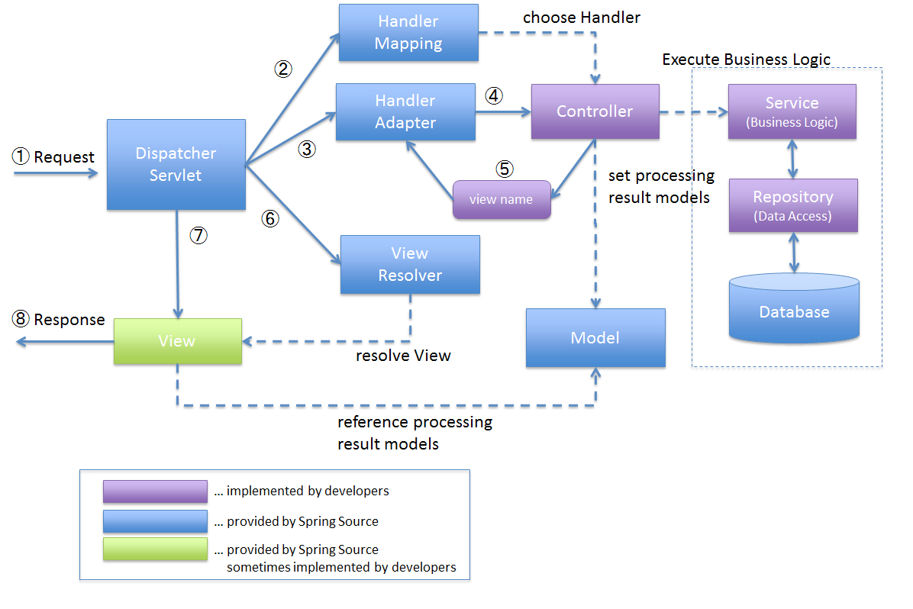

# Introduction to Spring MVC

**Spring MVC (Model-View-Controller)** is a popular web framework built on top of the Spring framework that provides a systematic and scalable approach to online application development. It adheres to the MVC design pattern, which divides the programme into three major components: the model, the view, and the controller.

The model represents the application's data and business logic. It encompasses the state and behavior of the programme, such as receiving and processing data from databases or other sources. Model objects are usually simple Java classes, sometimes known as POJOs (Plain Old Java Objects).

The view is in charge of displaying the data to the user. It specifies the user interface and how data is presented on the client side. Views are frequently built using technologies such as JSP.

The controller serves as a bridge between the model and the display. It receives user input, interacts with the model to obtain or update data, and picks the appropriate view to present the answer. Spring MVC controllers are Java classes that are often annotated with Spring annotations to provide request mappings and handle particular URLs.

Spring MVC provides a robust collection of capabilities and components to aid in the creation of web applications. Among the important aspects are:

1. **Request Mapping:** Using annotations or XML settings, you may map URLs to particular controllers and functions in Spring MVC.
2. **Data Binding:** It includes robust data binding features that allow you to transform request parameters to Java objects and vice versa.
3. **Validation:** Spring MVC offers data validation using annotations or custom validators, ensuring that user input is correct and fits particular requirements.
4. **View Resolution:** Spring MVC provides a number of view resolvers that may be used to select the right view depending on the request, such as JSP views, Thymeleaf templates, or even JSON/XML answers.
5. **Interceptors:** Interceptors allow you to intercept and preprocess requests before they reach the controller or after they have been handled by the controller. They can be used for purposes such as authentication, logging, and changing request/response characteristics.
6. **Internationalization and Localization:**: Spring MVC has capabilities for dealing with internationalization and localization, making it easy to design applications that support many languages and geographies.
7. **Handling Form Submissions:** Spring MVC streamlines the processing of form submissions, including form validation, showing validation failures, and binding form input to model objects.
8. **RESTful Services:** Spring MVC's support for content negotiation, HTTP method mapping, and data conversion may be utilised to create RESTful web services.

## Spring MVC Architecture

**Spring MVC (Model-View-Controller)** is an architectural design pattern used in web application development with the Spring Framework. It offers a systematic method to developing web applications by separating data management, user interface, and application logic issues. 

Here's a summary of the Spring MVC architecture's components and their roles:

* **Model:** The model represents the application's data and business logic. It encapsulates the data of the application and offers methods for accessing and manipulating that data. The model in the Spring MVC environment is frequently made up of POJOs (Plain Old Java Objects) or entities reflecting the application's domain.
* **View:** The view is in charge of rendering the application's user interface. It displays the model's data to the user in a manner that is simple to understand and interact with. The view in Spring MVC is often developed with template technologies such as **JSP (JavaServer Pages), Thymeleaf, or FreeMarker**.
* **Controller:** The controller processes user requests and works as a liaison between the model and the display. It takes user input, activates the relevant business logic in the model, and chooses the suitable view to present the answer. The controller in Spring MVC is implemented as a Java class annotated with **@Controller** or **@RestController**, and it specifies methods that are mapped to certain URLs or URL patterns.

### The following diagram depicts the Spring MVC processing flow from the time the request is received until the response is provided.

The following is the control flow in the Spring MVC architecture:

## Spring MVC Processing Flow in Steps

1. The request is received by **DispatcherServlet**.
2. **HandlerMapping** is tasked with picking a suitable **controller** by **DispatcherServlet**. **HandlerMapping** picks the controller that is mapped to the incoming request URL and delivers it to **DispatcherServlet** together with the (chosen Handler) and **Controller**.
3. **DispatcherServlet** delegated the duty of executing the **Controller**'s business logic to **HandlerAdapter**.
4. **HandlerAdapter** invokes the **Controller**'s business logic operation.
5. The **Controller** does the business logic, saves the outcome of the processing in **Model**, and returns the logical name of the **view** to **HandlerAdapter**.
6. **ViewResolver** receives the duty of resolving the View corresponding to the View name from **DispatcherServlet**. **ViewResolver** retrieves the **View** associated with the given **View name**.
7. The rendering process is dispatched to the returning **View** via **DispatcherServlet**.
8. **View** returns the response after rendering **Model** data.

