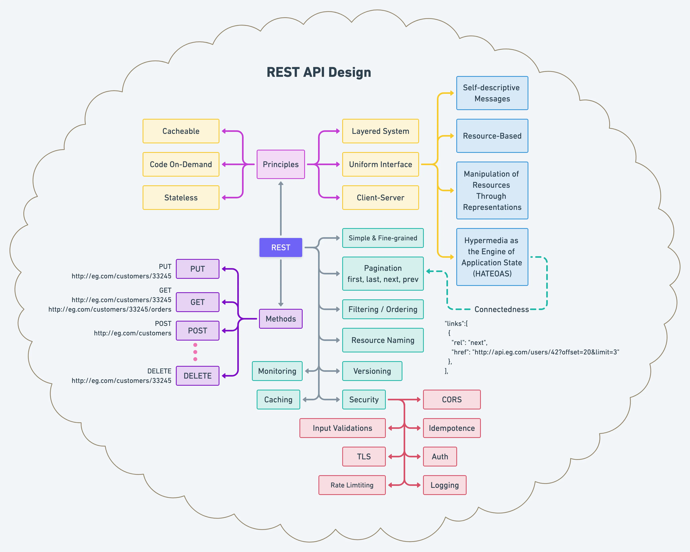

# Rest Architecture

The Representational State Transfer (REST) architectural style is not a technology that can be purchased or added to a software development project. REST is a mindset that elevates information to the status of a first-class component of the architectures we create.

Dr. Roy Fielding's thesis, "**Architectural Styles and the Design of Network-based Software Architecture,**" established and collected the ideas and words used to characterise "RESTful" systems. This is an academic text, but it is a quick and easy approach to demonstrate the fundamentals of RESTful design.

The concept is summarized as follows: by making certain architectural decisions, we may achieve desirable qualities from the systems we construct. Although the limits outlined in this architectural style are broadly applicable, they are not meant to be employed universally.

The REST is founded on a set of principles and limitations that enhance system scalability, simplicity, and interoperability. The following are the major components of the REST architecture:

**Source: DevGenius**

## What does Representational State Transfer mean?

**Transferring**, accessing and manipulating text data **representations** in a **stateless** manner. 

When properly deployed, it enables uniform compatibility across diverse internet applications.
The term _stateless_ is important in this context since it allows apps to interact agnostic-ally. A **Uniform Resource Locator (URL)** is used to access a RESTful API service. This logical name isolates the resource's identity from what is accepted or returned. 

What is really exposed is not a random service, but an information resource that represents something of value to a consumer.
The URL must be able to be **created**, **requested**, **updated**, or **removed**. This series of procedures is known colloquially as **C.R.U.D**.

This starting point would be provided someplace to allow users to interact with the library's REST APIs. When the request is returned, it might be in **XML**, **JSON**, or a **hypermedia format**. When feasible, current formats should be reused, although there is an increasing acceptance of correctly developed media types.

A client would send a **Hypertext Transfer Protocol (HTTP)** to GET request to request and obtain the resource. This is the most common request, and it is conducted whenever you input a URL into a browser and press return, pick a bookmark, or click on an anchor reference link.

## Below are the **properties** of RESTful Architecture

* Performance
* Simplicity
* Visibility
* Reliability
* Scalability
* Modifiability
* Portability

## Below are the **constraints** of RESTful Architecture

* Uniform Interface
* Code on Demand
* Layered System
* Client-Server
* Stateless
* Cacheable

## RICHARDSON MATURITY MODEL

Leonard Richardson created a Maturity Model in part to assist to clarify the distinctions between SOAP and REST, as well as to provide a framework for defining the many types of systems that many people were incorrectly calling "REST." The categories may be thought of as a measure of how tightly a system embraces the various parts of web technology: information resources, HTTP as an application protocol, and hypermedia as a medium of control.

**LEVEL 0:** This is basically where SOAP is. There are no information resources, HTTP is treated like a transport protocol, and there is no concept of hypermedia.

**Conclusion:** REST and SOAP are different approaches.

**LEVEL 1:** URLs are used, but not always as appropriate information resources, and everything is usually a GET request (including requests that update server state). Most people new to REST first build systems that look like this.

**LEVEL 2:** URLs are used to identify and represent information resources. HTTP is seen as an application protocol, with content negotiation occurring on occasion. Because they only handle non-hypermedia formats, most Internet-facing "REST" web services are only at this level.

**LEVEL 3:** URLs are used to identify and represent information resources. HTTP is regarded as an application protocol that allows for content negotiation. Hypermedia drives client interactions.

## Below are the "Verbs" or "HTTP Methods" used in RESTful Architecture

Below are main HTTP verbs, which are used by well-designed RESTful systems.

* **GET:** Returns an entity in response to the requested resource
* **POST:** Returns an entity defining the outcome of the action
* **PUT:** Store a new or modified entity at a URI (Uniform Resource Identifier)
* **DELETE:** Request that a resource is removed now or later
* **HEAD:** Returns the entity's header field related to the requested resource
* **OPTIONS:** Interrogate a server about a resource by asking what other verbs as applicable
* **PATCH:** Updates only the specified fields of an entity at a URI

## Response Codes

There is a series of response codes used while performing HTTP Operations

Each set of numbers can be categorized as the following:

* 1xx: Informational 
* 2xx: Success 
* 3xx: Redirection
* 4xx: Client error 
* 5xx: Server error
