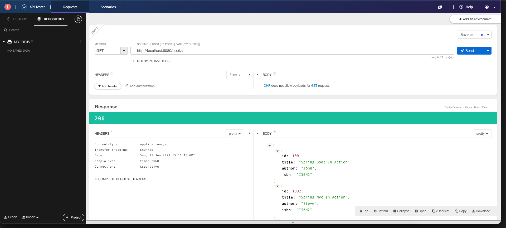
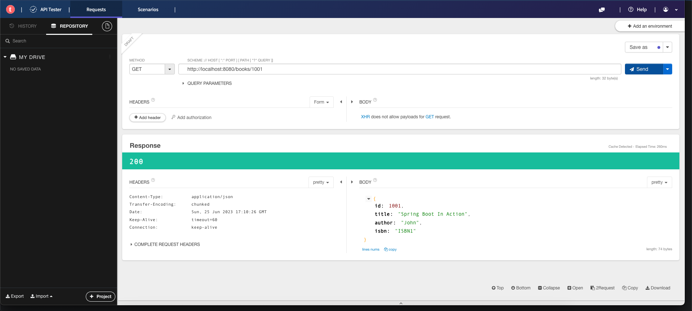
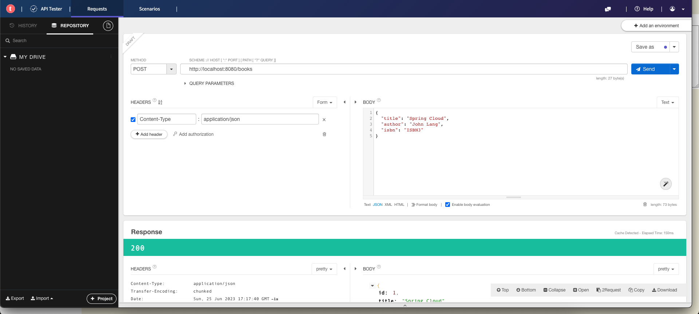

# Build Restful WebServices in Spring Boot

Let's look at an example of a simple Spring Boot RESTful Web service for maintaining a book collection. We'll walk
through the process of setting up the project and operating the service.

# Prerequisites

* [Java 1.8](https://www.oracle.com/java/technologies/downloads/) or later
* [Maven 3.5+](https://maven.apache.org/download.cgi) or [Gradle 7.5+](https://gradle.org/install/)
* You can also import the code straight into your IDE:
    * Intellij IDEA
    * Spring Tools Suite
    * VSCode
* Install [Talend API Tester - Free Edition](https://chrome.google.com/webstore/detail/talend-api-tester-free-ed/aejoelaoggembcahagimdiliamlcdmfm/related) in Chrome for validating HTTP methods

## Step 1: Create a New Spring Boot Project

- Go to https://start.spring.io/. This service gathers all the dependencies required for an application and handles the
  majority of the setup for you.
- Setting up a Spring Project using Spring Initializr http://start.spring.io and select the following options
    - Project as `Maven` or `Gradle`
    - Language as `Java` or `Kotlin`
    - Spring Boot Version as `3.0.7` or _**latest one**_
    - Project Metadata as
        - Group as `com.springcourse`
        - Artifact as `learn-springboot`
        - Name as `learn-springboot`
        - Description can be your choice
        - Package name automatically generated by the tool based on **Group, Artifact**
        - Packaging as `jar`
        - Java version as `17` for now
        - Type "web" into the search box, and we'll obtain **Spring Web**, **Spring Data JPA**, and h2 dependency and
          add it
        - Click the **"Generate"** button to create a project zip file with the basic spring boot application structure
        - And then import the project in your favorite IDE


Your pom.xml should be like

```xml
<?xml version="1.0" encoding="UTF-8"?>
<project xmlns="http://maven.apache.org/POM/4.0.0" xmlns:xsi="http://www.w3.org/2001/XMLSchema-instance"
         xsi:schemaLocation="http://maven.apache.org/POM/4.0.0 https://maven.apache.org/xsd/maven-4.0.0.xsd">
    <modelVersion>4.0.0</modelVersion>
    <parent>
        <groupId>org.springframework.boot</groupId>
        <artifactId>spring-boot-starter-parent</artifactId>
        <version>3.1.0</version>
        <relativePath/> <!-- lookup parent from repository -->
    </parent>
    <groupId>com.springcourse</groupId>
    <artifactId>learn-spring-boot</artifactId>
    <version>0.0.1-SNAPSHOT</version>
    <name>learn-spring-boot</name>
    <description>Demo project for Spring Boot</description>
    <properties>
        <java.version>17</java.version>
    </properties>
    <dependencies>
        <dependency>
            <groupId>org.springframework.boot</groupId>
            <artifactId>spring-boot-starter-web</artifactId>
        </dependency>
        <dependency>
            <groupId>org.springframework.boot</groupId>
            <artifactId>spring-boot-starter-actuator</artifactId>
        </dependency>
        <dependency>
            <groupId>org.springframework.boot</groupId>
            <artifactId>spring-boot-starter-data-jpa</artifactId>
        </dependency>

        <dependency>
            <groupId>com.h2database</groupId>
            <artifactId>h2</artifactId>
            <scope>runtime</scope>
        </dependency>

        <dependency>
            <groupId>org.springframework.boot</groupId>
            <artifactId>spring-boot-starter-test</artifactId>
            <scope>test</scope>
        </dependency>
    </dependencies>

    <build>
        <plugins>
            <plugin>
                <groupId>org.springframework.boot</groupId>
                <artifactId>spring-boot-maven-plugin</artifactId>
            </plugin>
        </plugins>
    </build>

</project>


```

## Step 2: Extract the Project and Open in IDE

Extract the downloaded ZIP file and open the project in your preferred IDE.

## Step 3: Define the Book Model/Entity, under the package of com.springcourse.learnspringboot.book

```java
package com.springcourse.learnspringboot.book;

import jakarta.persistence.Entity;
import jakarta.persistence.GeneratedValue;
import jakarta.persistence.GenerationType;
import jakarta.persistence.Id;
import jakarta.persistence.Table;

@Entity
@Table(name = "books")
public class Book {
    @Id
    @GeneratedValue(strategy = GenerationType.IDENTITY)
    private Long id;

    private String title;
    private String author;
    private String isbn;

    public Long getId() {
        return id;
    }

    public void setId(Long id) {
        this.id = id;
    }

    public String getTitle() {
        return title;
    }

    public void setTitle(String title) {
        this.title = title;
    }

    public String getAuthor() {
        return author;
    }

    public void setAuthor(String author) {
        this.author = author;
    }

    public String getIsbn() {
        return isbn;
    }

    public void setIsbn(String isbn) {
        this.isbn = isbn;
    }

    @Override
    public String toString() {
        return "Book{" +
                "id=" + id +
                ", title='" + title + '\'' +
                ", author='" + author + '\'' +
                ", isbn='" + isbn + '\'' +
                '}';
    }
}

```

## Step 4: Add the following entries in `application.properties` and create `data.sql` file(/src/main/resources)

### Note: For learning purposes, we are using the h2 in-memory database.
```properties
spring.datasource.url=jdbc:h2:mem:testdb
spring.h2.console.enabled=true
spring.jpa.defer-datasource-initialization=true
spring.jpa.show-sql=true
```

_**data.sql**_

```roomsql
insert into books(id,title,author,isbn)
values(1001,'Spring Boot In Action', 'John', 'ISBN1');

insert into books(id,title,author,isbn)
values(1002,'Spring Mvc In Action', 'Steve', 'ISBN2');

insert into books(id,title,author,isbn)
values(1003,'Spring Core In Action', 'Mike', 'ISBN3');

```

## Step 5: Create the Book Repository

Create a new Java interface called BookRepository that extends Spring Data JPA's JpaRepository interface. This interface
will handle Book entity database actions.

```java
package com.springcourse.learnspringboot.book;

import org.springframework.data.jpa.repository.JpaRepository;
import org.springframework.stereotype.Repository;

// @Repository: It is one of the specializations of @Component annotation used for storing purpose
@Repository
public interface BookRepository extends JpaRepository<Book, Long> {
}

```

## Step 6: Implement the Book Controller for HTTP GET method (@GetMapping)

Create a new Java class called **BookController** and mark it with the **`@RestController`** annotation. Define methods for handling HTTP operations such as `GET` for retrieving books. Use the `BookRepository` to communicate with the database after injecting it into the controller.

```java
package com.springcourse.learnspringboot.book;

import java.util.List;

import org.springframework.web.bind.annotation.GetMapping;
import org.springframework.web.bind.annotation.RequestMapping;
import org.springframework.web.bind.annotation.RestController;

@RestController
@RequestMapping("/books")
public class BookController {
    private final BookRepository bookRepository;

    public BookController(BookRepository bookRepository) {
        this.bookRepository = bookRepository;
    }

    @GetMapping
    public List<Book> getAllBooks() {
        return bookRepository.findAll();
    }
}
```

Launch the application and observe the logs where h2 database name testdb and table `books` created
```logs
2023-06-25T20:03:12.491+05:30  INFO 3482 --- [           main] o.s.b.a.h2.H2ConsoleAutoConfiguration    : H2 console available at '/h2-console'. Database available at 'jdbc:h2:mem:testdb'

Hibernate: drop table if exists books cascade

Hibernate: create table books (id bigint generated by default as identity, author varchar(255), isbn varchar(255), title varchar(255), primary key (id))
```
```logs
2023-06-25T20:03:10.079+05:30  INFO 3482 --- [           main] c.s.l.LearnSpringBootApplication         : Starting LearnSpringBootApplication using Java 17.0.6 with PID 3482 (/Users/puneethsai/springworkspace/learn-spring-boot/target/classes started by puneethsai in /Users/puneethsai/springworkspace/learn-spring-boot)
2023-06-25T20:03:10.084+05:30  INFO 3482 --- [           main] c.s.l.LearnSpringBootApplication         : No active profile set, falling back to 1 default profile: "default"
2023-06-25T20:03:11.156+05:30  INFO 3482 --- [           main] .s.d.r.c.RepositoryConfigurationDelegate : Bootstrapping Spring Data JPA repositories in DEFAULT mode.
2023-06-25T20:03:11.223+05:30  INFO 3482 --- [           main] .s.d.r.c.RepositoryConfigurationDelegate : Finished Spring Data repository scanning in 55 ms. Found 1 JPA repository interfaces.
2023-06-25T20:03:11.882+05:30  INFO 3482 --- [           main] o.s.b.w.embedded.tomcat.TomcatWebServer  : Tomcat initialized with port(s): 8080 (http)
2023-06-25T20:03:11.895+05:30  INFO 3482 --- [           main] o.apache.catalina.core.StandardService   : Starting service [Tomcat]
2023-06-25T20:03:11.896+05:30  INFO 3482 --- [           main] o.apache.catalina.core.StandardEngine    : Starting Servlet engine: [Apache Tomcat/10.1.8]
2023-06-25T20:03:12.033+05:30  INFO 3482 --- [           main] o.a.c.c.C.[Tomcat].[localhost].[/]       : Initializing Spring embedded WebApplicationContext
2023-06-25T20:03:12.036+05:30  INFO 3482 --- [           main] w.s.c.ServletWebServerApplicationContext : Root WebApplicationContext: initialization completed in 1874 ms
2023-06-25T20:03:12.167+05:30  INFO 3482 --- [           main] com.zaxxer.hikari.HikariDataSource       : HikariPool-1 - Starting...
2023-06-25T20:03:12.467+05:30  INFO 3482 --- [           main] com.zaxxer.hikari.pool.HikariPool        : HikariPool-1 - Added connection conn0: url=jdbc:h2:mem:testdb user=SA
2023-06-25T20:03:12.470+05:30  INFO 3482 --- [           main] com.zaxxer.hikari.HikariDataSource       : HikariPool-1 - Start completed.
2023-06-25T20:03:12.491+05:30  INFO 3482 --- [           main] o.s.b.a.h2.H2ConsoleAutoConfiguration    : H2 console available at '/h2-console'. Database available at 'jdbc:h2:mem:testdb'
2023-06-25T20:03:12.678+05:30  INFO 3482 --- [           main] o.hibernate.jpa.internal.util.LogHelper  : HHH000204: Processing PersistenceUnitInfo [name: default]
2023-06-25T20:03:12.757+05:30  INFO 3482 --- [           main] org.hibernate.Version                    : HHH000412: Hibernate ORM core version 6.2.2.Final
2023-06-25T20:03:12.760+05:30  INFO 3482 --- [           main] org.hibernate.cfg.Environment            : HHH000406: Using bytecode reflection optimizer
2023-06-25T20:03:12.960+05:30  INFO 3482 --- [           main] o.h.b.i.BytecodeProviderInitiator        : HHH000021: Bytecode provider name : bytebuddy
2023-06-25T20:03:13.165+05:30  INFO 3482 --- [           main] o.s.o.j.p.SpringPersistenceUnitInfo      : No LoadTimeWeaver setup: ignoring JPA class transformer
2023-06-25T20:03:13.256+05:30  INFO 3482 --- [           main] org.hibernate.orm.dialect                : HHH035001: Using dialect: org.hibernate.dialect.H2Dialect, version: 2.1.214
2023-06-25T20:03:13.720+05:30  INFO 3482 --- [           main] o.h.b.i.BytecodeProviderInitiator        : HHH000021: Bytecode provider name : bytebuddy
2023-06-25T20:03:14.727+05:30  INFO 3482 --- [           main] o.h.e.t.j.p.i.JtaPlatformInitiator       : HHH000490: Using JtaPlatform implementation: [org.hibernate.engine.transaction.jta.platform.internal.NoJtaPlatform]
Hibernate: drop table if exists books cascade 
Hibernate: create table books (id bigint generated by default as identity, author varchar(255), isbn varchar(255), title varchar(255), primary key (id))
2023-06-25T20:03:14.782+05:30  INFO 3482 --- [           main] o.h.t.s.i.e.GenerationTargetToDatabase   : HHH000476: Executing script '[injected ScriptSourceInputNonExistentImpl script]'
2023-06-25T20:03:14.785+05:30  INFO 3482 --- [           main] j.LocalContainerEntityManagerFactoryBean : Initialized JPA EntityManagerFactory for persistence unit 'default'
2023-06-25T20:03:15.125+05:30  WARN 3482 --- [           main] JpaBaseConfiguration$JpaWebConfiguration : spring.jpa.open-in-view is enabled by default. Therefore, database queries may be performed during view rendering. Explicitly configure spring.jpa.open-in-view to disable this warning
2023-06-25T20:03:15.597+05:30  INFO 3482 --- [           main] o.s.b.a.e.web.EndpointLinksResolver      : Exposing 1 endpoint(s) beneath base path '/actuator'
2023-06-25T20:03:15.681+05:30  INFO 3482 --- [           main] o.s.b.w.embedded.tomcat.TomcatWebServer  : Tomcat started on port(s): 8080 (http) with context path ''
2023-06-25T20:03:15.698+05:30  INFO 3482 --- [           main] c.s.l.LearnSpringBootApplication         : Started LearnSpringBootApplication in 6.139 seconds (process running for 6.658)
```

and then go to the browser and access the below http://localhost:8080/books results, observe the sql query generated by spring-boot-data-jpa dependency 

> Hibernate: select b1_0.id,b1_0.author,b1_0.isbn,b1_0.title from books b1_0




## Step 7: Implement the Book Controller for HTTP GET for fetching particular bookId (@GetMapping) 

Add the following code snippet and then restart the application

```java
@GetMapping("/{id}")
public ResponseEntity<Book> getBookById(@PathVariable Long id) {
    Optional<Book> book = bookRepository.findById(id);
    return book.map(ResponseEntity::ok)
            .orElseGet(() -> ResponseEntity.notFound().build());
}
```

Access the url http://localhost:8080/books/1001 and if you observe application logs, we didn't have any sql query for fetching the details inside the application, it will be taken care spring boot data jpa dependency and spring framework

> **Hibernate: select b1_0.id,b1_0.author,b1_0.isbn,b1_0.title from books b1_0 where b1_0.id=?**



## Step 8: Implement the Book Controller for HTTP POST for creating a new Book record (@PostMapping)

```java
@PostMapping
public Book createBook(@RequestBody Book book) {
    return bookRepository.save(book);
}
```

> Use the below payload for post-request, without `id `field as it will generate automatically a hibernate framework
```json
{
  "title": "Spring Cloud",
  "author": "John Lang",
  "isbn": "ISBN3"
}
```


By logging into the H2 database and click Connect (without password)

http://localhost:8080/h2-console/

left side, you can the BOOKS table, and you can run the select query and verify newly inserted record.


## Step 9: Implement the Book Controller for HTTP DELETE for deleting a record by id (@DeleteMapping)

http://localhost:8080/books/1001 and it will 204 status after successfully deleted the record.


That's it! For maintaining books, you have developed a straightforward Spring Boot RESTful Web service. According to your needs, you may expand it further by including more endpoints, adding more business logic, and interacting with databases or other services.