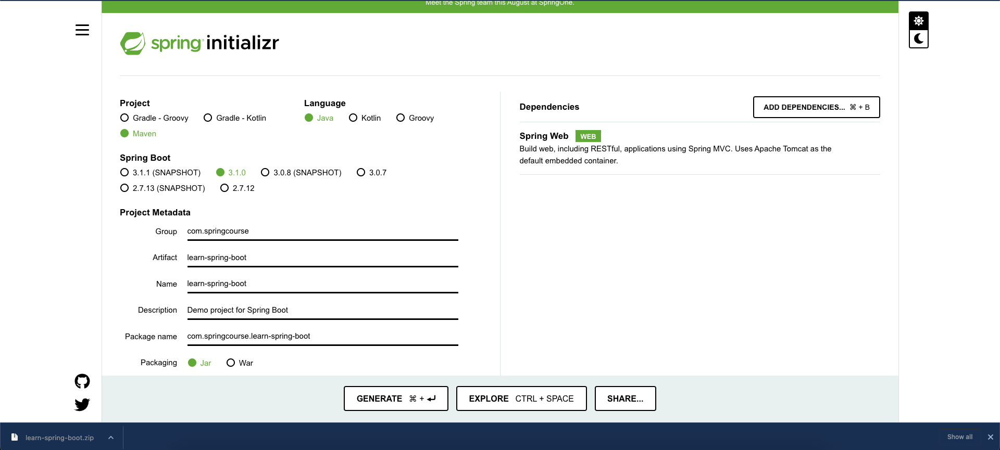

# Building an Application with Spring Boot

This module is intended to give you a taste of Spring Boot. If you wish to construct your own Spring Boot-based project,
go to [Spring Initializr](https://start.spring.io/), enter your project information, select your settings, and obtain a
zip file containing a packaged up project.

You will use Spring Boot to create a small web application and add some helpful services to it.

# Prerequisites

* [Java 1.8](https://www.oracle.com/java/technologies/downloads/) or later
* [Maven 3.5+](https://maven.apache.org/download.cgi) or [Gradle 7.5+](https://gradle.org/install/)
* You can also import the code straight into your IDE:
    * Intellij IDEA
    * Spring Tools Suite
    * VSCode

You may either begin from the beginning and complete each step, or you can skip fundamental setup stages that you are
already familiar with. In any case, you will have functional code.

To start from scratch, move on to Starting with Spring Initializr.

## Step1: Starting with Spring Initializr

- Go to https://start.spring.io/. This service gathers all the dependencies required for an application and handles the
  majority of the setup for you.
- Setting up a Spring Project using Spring Initializr http://start.spring.io and select the following options
    - Project as `Maven` or `Gradle`
    - Language as `Java` or `Kotlin`
    - Spring Boot Version as `3.0.7` or _**latest one**_
    - Project Metadata as
        - Group as `com.springcourse`
        - Artifact as `learn-springboot`
        - Name as `learn-springboot`
        - Description can be your choice
        - Package name automatically generated by the tool based on **Group, Artifact**
        - Packaging as `jar`
        - Java version as `17` for now
        - Type "web" into the search box, and we'll obtain **Spring Web** and add it
        - Click the **"Generate"** button to create a project zip file with the basic spring boot application structure
        - And then import the project in your favorite IDE



## Step2: Create a Simple Web Application

Now you can create a web controller for a simple web application under
(/src/main/java/com/springcourse/learnspringboot/HellWorldController.java) shows:

```java
package com.springcourse.learnspringboot;

import org.springframework.web.bind.annotation.GetMapping;
import org.springframework.web.bind.annotation.RestController;

@RestController // @Controller + @ResponseBody = @RestController
public class HelloWorldController {

    @GetMapping("/")
    public String helloWorld() {
        return "Welcome to Spring Boot Course!";
    }
}

```

## Observations

1. The class is marked as a **@RestController**, indicating that it is ready to handle web requests using Spring MVC.
2. **@GetMapping** redirects to the helloWorld() function. When called from a browser or the command line, the method
   returns a string "Welcome to Spring Boot Course!".
3. Because **@RestController** mixes **@Controller and @ResponseBody** annotations, HTTP requests return data rather
   than a view.

## Step3: Extend LearnSpringBootApplication class

Spring Initializr generates a basic LearnSpringBootApplication class for you. However, in this situation, it is overly
simplistic. The application class must be modified to reflect the following listing (from *
*src/main/java/com/springcourse/learnspringboot/LearnSpringBootApplication.java**):

```java
package com.springcourse.learnspringboot;

import java.util.Arrays;

import org.springframework.boot.CommandLineRunner;
import org.springframework.boot.SpringApplication;
import org.springframework.boot.autoconfigure.SpringBootApplication;
import org.springframework.context.ApplicationContext;
import org.springframework.context.annotation.Bean;

@SpringBootApplication
public class LearnSpringBootApplication {

    public static void main(String[] args) {
        SpringApplication.run(LearnSpringBootApplication.class, args);
    }

    @Bean
    public CommandLineRunner commandLineRunner(ApplicationContext context) {
        return args -> {

            System.out.println("Let's have a look at the beans offered by Spring Boot:");

            String[] beanNames = context.getBeanDefinitionNames();
            Arrays.stream(beanNames)
                    .sorted() // Sorting
                    .forEach(System.out::println); // Displaying all the beans where autoconfiguration has happened

        };
    }

}

```

Let's discuss the annotations being used here

> **@SpringBootApplication = @Configuration + @EnableAutoConfiguration + @ComponentScan**

* **@Configuration:** This class is identified as a source of bean definitions for the application context
* **@EnableAutoConfiguration:** Spring Boot is instructed to begin adding beans depending on classpath, other beans, and different property settings. If `spring-webmvc` is in the classpath, for example, this annotation marks the application as a web application and triggers important behaviours such as configuring a **DispatcherServlet**.
In Spring Web-MVC application, `DispatcherServlet` has to be configured separately in `web.xml`, however, in spring boot application automatically it will happen in behind the scenes.
* **@ComponentScan:** Spring is instructed to hunt for other components, configurations, and services in the `com.springcourse.learnspringboot` package in order to locate the controllers.

To launch an application, the `main()` function calls Spring Boot's `SpringApplication.run()` method.

> NOTE: Did you note that there wasn't a single XML line? There is also no `web.xml` file. This web application is all Java, and you did not have to deal with any plumbing or infrastructure configuration.

There is also a **CommandLineRunner** method that is designated as a **@Bean** and is executed on startup. It obtains all the beans that were produced by your application or that Spring Boot added automatically. It organises them and prints them.

## Step4: Run LearnSpringBootApplication Class for verifying Auto Configuration Feature

If you use **Maven**, run the following command in a terminal window (in the complete) directory:

> ./mvnw spring-boot:run

or 

> Right-click on **LearnSpringBootApplication** and Run 

You should see output similar to the following where Spring Boot AutoConfiguration happened for the beans:

```text
2023-06-22T07:19:12.128+05:30  INFO 3223 --- [           main] c.s.l.LearnSpringBootApplication         : Started LearnSpringBootApplication in 2.091 seconds (process running for 2.547)
Let's have a look at the beans offered by Spring Boot:
applicationAvailability
applicationTaskExecutor
basicErrorController
beanNameHandlerMapping
beanNameViewResolver
characterEncodingFilter
commandLineRunner
conventionErrorViewResolver
defaultServletHandlerMapping
defaultViewResolver
dispatcherServlet
dispatcherServletRegistration
error
errorAttributes
errorPageCustomizer
errorPageRegistrarBeanPostProcessor
flashMapManager
forceAutoProxyCreatorToUseClassProxying
formContentFilter
handlerExceptionResolver
handlerFunctionAdapter
helloWorldController
httpRequestHandlerAdapter
jacksonObjectMapper
jacksonObjectMapperBuilder
jsonComponentModule
jsonMixinModule
jsonMixinModuleEntries
learnSpringBootApplication
lifecycleProcessor
localeCharsetMappingsCustomizer
localeResolver
mappingJackson2HttpMessageConverter
messageConverters
multipartConfigElement
multipartResolver
mvcContentNegotiationManager
mvcConversionService
mvcHandlerMappingIntrospector
mvcPathMatcher
mvcPatternParser
mvcResourceUrlProvider
mvcUriComponentsContributor
mvcUrlPathHelper
mvcValidator
mvcViewResolver
org.springframework.aop.config.internalAutoProxyCreator
org.springframework.boot.autoconfigure.AutoConfigurationPackages
org.springframework.boot.autoconfigure.aop.AopAutoConfiguration
org.springframework.boot.autoconfigure.aop.AopAutoConfiguration$ClassProxyingConfiguration
org.springframework.boot.autoconfigure.availability.ApplicationAvailabilityAutoConfiguration
org.springframework.boot.autoconfigure.context.ConfigurationPropertiesAutoConfiguration
org.springframework.boot.autoconfigure.context.LifecycleAutoConfiguration
org.springframework.boot.autoconfigure.context.PropertyPlaceholderAutoConfiguration
org.springframework.boot.autoconfigure.http.HttpMessageConvertersAutoConfiguration
org.springframework.boot.autoconfigure.http.HttpMessageConvertersAutoConfiguration$StringHttpMessageConverterConfiguration
org.springframework.boot.autoconfigure.http.JacksonHttpMessageConvertersConfiguration
org.springframework.boot.autoconfigure.http.JacksonHttpMessageConvertersConfiguration$MappingJackson2HttpMessageConverterConfiguration
org.springframework.boot.autoconfigure.info.ProjectInfoAutoConfiguration
org.springframework.boot.autoconfigure.internalCachingMetadataReaderFactory
org.springframework.boot.autoconfigure.jackson.JacksonAutoConfiguration
org.springframework.boot.autoconfigure.jackson.JacksonAutoConfiguration$Jackson2ObjectMapperBuilderCustomizerConfiguration
org.springframework.boot.autoconfigure.jackson.JacksonAutoConfiguration$JacksonMixinConfiguration
org.springframework.boot.autoconfigure.jackson.JacksonAutoConfiguration$JacksonObjectMapperBuilderConfiguration
org.springframework.boot.autoconfigure.jackson.JacksonAutoConfiguration$JacksonObjectMapperConfiguration
org.springframework.boot.autoconfigure.jackson.JacksonAutoConfiguration$ParameterNamesModuleConfiguration
org.springframework.boot.autoconfigure.sql.init.SqlInitializationAutoConfiguration
org.springframework.boot.autoconfigure.ssl.SslAutoConfiguration
org.springframework.boot.autoconfigure.task.TaskExecutionAutoConfiguration
org.springframework.boot.autoconfigure.task.TaskSchedulingAutoConfiguration
org.springframework.boot.autoconfigure.web.client.RestTemplateAutoConfiguration
org.springframework.boot.autoconfigure.web.embedded.EmbeddedWebServerFactoryCustomizerAutoConfiguration
org.springframework.boot.autoconfigure.web.embedded.EmbeddedWebServerFactoryCustomizerAutoConfiguration$TomcatWebServerFactoryCustomizerConfiguration
org.springframework.boot.autoconfigure.web.servlet.DispatcherServletAutoConfiguration
org.springframework.boot.autoconfigure.web.servlet.DispatcherServletAutoConfiguration$DispatcherServletConfiguration
org.springframework.boot.autoconfigure.web.servlet.DispatcherServletAutoConfiguration$DispatcherServletRegistrationConfiguration
org.springframework.boot.autoconfigure.web.servlet.HttpEncodingAutoConfiguration
org.springframework.boot.autoconfigure.web.servlet.MultipartAutoConfiguration
org.springframework.boot.autoconfigure.web.servlet.ServletWebServerFactoryAutoConfiguration
org.springframework.boot.autoconfigure.web.servlet.ServletWebServerFactoryConfiguration$EmbeddedTomcat
org.springframework.boot.autoconfigure.web.servlet.WebMvcAutoConfiguration
org.springframework.boot.autoconfigure.web.servlet.WebMvcAutoConfiguration$EnableWebMvcConfiguration
org.springframework.boot.autoconfigure.web.servlet.WebMvcAutoConfiguration$WebMvcAutoConfigurationAdapter
org.springframework.boot.autoconfigure.web.servlet.error.ErrorMvcAutoConfiguration
org.springframework.boot.autoconfigure.web.servlet.error.ErrorMvcAutoConfiguration$DefaultErrorViewResolverConfiguration
org.springframework.boot.autoconfigure.web.servlet.error.ErrorMvcAutoConfiguration$WhitelabelErrorViewConfiguration
org.springframework.boot.autoconfigure.websocket.servlet.WebSocketServletAutoConfiguration
org.springframework.boot.autoconfigure.websocket.servlet.WebSocketServletAutoConfiguration$TomcatWebSocketConfiguration
org.springframework.boot.context.internalConfigurationPropertiesBinder
org.springframework.boot.context.properties.BoundConfigurationProperties
org.springframework.boot.context.properties.ConfigurationPropertiesBindingPostProcessor
org.springframework.boot.context.properties.EnableConfigurationPropertiesRegistrar.methodValidationExcludeFilter
org.springframework.boot.sql.init.dependency.DatabaseInitializationDependencyConfigurer$DependsOnDatabaseInitializationPostProcessor
org.springframework.context.annotation.internalAutowiredAnnotationProcessor
org.springframework.context.annotation.internalCommonAnnotationProcessor
org.springframework.context.annotation.internalConfigurationAnnotationProcessor
org.springframework.context.event.internalEventListenerFactory
org.springframework.context.event.internalEventListenerProcessor
parameterNamesModule
preserveErrorControllerTargetClassPostProcessor
propertySourcesPlaceholderConfigurer
requestContextFilter
requestMappingHandlerAdapter
requestMappingHandlerMapping
resourceHandlerMapping
restTemplateBuilder
restTemplateBuilderConfigurer
routerFunctionMapping
server-org.springframework.boot.autoconfigure.web.ServerProperties
servletWebServerFactoryCustomizer
simpleControllerHandlerAdapter
spring.info-org.springframework.boot.autoconfigure.info.ProjectInfoProperties
spring.jackson-org.springframework.boot.autoconfigure.jackson.JacksonProperties
spring.lifecycle-org.springframework.boot.autoconfigure.context.LifecycleProperties
spring.mvc-org.springframework.boot.autoconfigure.web.servlet.WebMvcProperties
spring.servlet.multipart-org.springframework.boot.autoconfigure.web.servlet.MultipartProperties
spring.sql.init-org.springframework.boot.autoconfigure.sql.init.SqlInitializationProperties
spring.ssl-org.springframework.boot.autoconfigure.ssl.SslProperties
spring.task.execution-org.springframework.boot.autoconfigure.task.TaskExecutionProperties
spring.task.scheduling-org.springframework.boot.autoconfigure.task.TaskSchedulingProperties
spring.web-org.springframework.boot.autoconfigure.web.WebProperties
sslBundleRegistry
sslPropertiesSslBundleRegistrar
standardJacksonObjectMapperBuilderCustomizer
stringHttpMessageConverter
taskExecutorBuilder
taskSchedulerBuilder
themeResolver
tomcatServletWebServerFactory
tomcatServletWebServerFactoryCustomizer
tomcatWebServerFactoryCustomizer
viewControllerHandlerMapping
viewNameTranslator
viewResolver
webServerFactoryCustomizerBeanPostProcessor
websocketServletWebServerCustomizer
welcomePageHandlerMapping
welcomePageNotAcceptableHandlerMapping
```

You can clearly see **org.springframework.boot.autoconfigure** beans. There is also a **tomcatServletWebServerFactory**

Because of the nature of transitive dependencies, if we add the **spring-boot-starter-web** dependency, it will automatically load/include the **spring-boot-starter-tomcat** dependency to the class that includes the **tomcatServletWebServerFactory**, which will give you with a Tomcat servlet container for executing an application.

Open the browser the access the below URL

> http://localhost:8080/

Returns

> Welcome to Spring Boot Course!

OR

Now, in a separate terminal window, launch the service using curl by issuing the following command (along with its output):

>$ curl localhost:8080

Welcome to Spring Boot Course!

## Step5: Verify Actuator Feature

If you're creating a website for an enterprise, you should probably include some management services. With its **actuator** module, Spring Boot supports various such services 
* Health
* Audits
* Beans

This capability may be obtained by including the following **actuator** dependency in **Maven** or **Gradle**.

**For Maven**, please add the following in `pom.xml` file

```xml
<dependency>
	<groupId>org.springframework.boot</groupId>
	<artifactId>spring-boot-starter-actuator</artifactId>
</dependency>
```

**For Gradle**, please add the following in `build.gradle` file

```text
implementation 'org.springframework.boot:spring-boot-starter-actuator'
```
Then restart the application. A new set of RESTful end points should have been introduced to the application. Spring Boot provides these management functions. The following is an example of typical output:

```text
management.endpoint.health-org.springframework.boot.actuate.autoconfigure.health.HealthEndpointProperties
management.endpoints.web-org.springframework.boot.actuate.autoconfigure.endpoint.web.WebEndpointProperties
management.endpoints.web.cors-org.springframework.boot.actuate.autoconfigure.endpoint.web.CorsEndpointProperties
management.health.diskspace-org.springframework.boot.actuate.autoconfigure.system.DiskSpaceHealthIndicatorProperties
management.info-org.springframework.boot.actuate.autoconfigure.info.InfoContributorProperties
management.metrics-org.springframework.boot.actuate.autoconfigure.metrics.MetricsProperties
management.observations-org.springframework.boot.actuate.autoconfigure.observation.ObservationProperties
management.server-org.springframework.boot.actuate.autoconfigure.web.server.ManagementServerProperties
management.simple.metrics.export-org.springframework.boot.actuate.autoconfigure.metrics.export.simple.SimpleProperties
```

The actuator exposes the following:
1. Actuator Health: http://localhost:8080/actuator/health
2. Actuator: http://localhost:8080/actuator

> Add `management.endpoint.shutdown.enabled=true` to your application.properties file to enable it as an HTTP endpoint, and expose it using management.endpoints.web.exposure.include=health,info,shutdown. However, for a publicly accessible application, you should generally not activate the shutdown endpoint.

For more details, please go through the [Spring Boot Documentation](https://docs.spring.io/spring-boot/docs/2.5.0/reference/htmlsingle/#actuator.endpoints)

