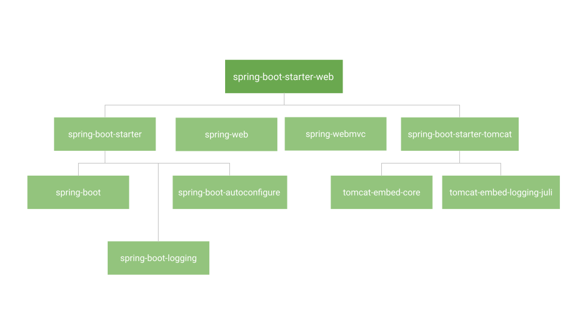

# Spring Boot Starters

When developing an application with Spring Framework, we usually include all the dependencies for the application to run.

Adding all of those dependencies to pom.xml or build.gradle not only takes time, but it also increases the file size. 

So Spring Boot has the solution to this problem by introducing the spring boot starters, which works on the mathematical concept transitive dependency.

That is, **A belong B, B belongs C, and C belong A**. In dependency terms if DependencyA belongs to DependencyB, DependencyB belongs to DependencyC, and DependencyC belongs to DependencyA.

So Spring Boot Starters combines all the related dependencies into single dependency. Instead of adding all related dependencies, we are required only to add one dependency.

For example, For Spring MVC web application, if we add only **spring-boot-starter-web**, related all the dependencies will download and available in IDE classpath

Spring Boot Starters are a collection of dependency descriptors that ease Spring Boot application configuration and dependency management. They make it easy to add common groups of dependencies to your project without having to explicitly declare each one. While the Spring Boot Starters do not have a defined hierarchical structure, they may be classified depending on their functionality or purpose. The following is a broad classification of various widely used Spring Boot Starters:

### 1. Core Starters

**spring-boot-starter**: The core starter that includes all essential dependencies for building a Spring Boot application

### 2. Web Starters

* **spring-boot-starter-web:** Includes the necessary dependencies to build web applications using Spring MVC
* **spring-boot-starter-webflux:** Provides dependencies for building reactive web applications using Spring WebFlux
* **spring-boot-starter-jersey:** Enables building web applications using the Jersey framework
* **spring-boot-starter-tomcat:** Provides an embedded Tomcat container for deploying web applications
* **spring-boot-starter-jetty:** Provides an embedded Jetty container for deploying web applications

### 3. Data Access Starters

* **spring-boot-starter-data-jpa:** Includes dependencies for using **Spring Data JPA** for database access
* **spring-boot-starter-data-mongodb:** Provides dependencies for using Spring Data MongoDB for MongoDB access
* **spring-boot-starter-data-redis:** Includes dependencies for using Spring Data Redis for Redis access
* **spring-boot-starter-jdbc:** Enables JDBC database access
* **spring-boot-starter-jooq:** Provides dependencies for using jOOQ for database access
* **spring-boot-starter-jpa:** Includes dependencies for using **Java Persistence API (JPA)** for database access

### 4. Security Starters

* **spring-boot-starter-security:** Includes dependencies for securing Spring Boot applications
* **spring-boot-starter-oauth2-client:** Provides dependencies for OAuth 2.0 client support
* **spring-boot-starter-oauth2-resource-server:** Enables building OAuth 2.0 resource servers

### 5. Actuator Starters

* **spring-boot-starter-actuator:** Enables monitoring and managing Spring Boot Applications

### 6. Testing Starters

* **spring-boot-starter-test:** Includes dependencies for testing Spring Boot applications
* **spring-boot-starter-test-junit4:** Provides JUnit 4 dependencies for testing
* **spring-boot-starter-test-junit5:** Provides JUnit 5 dependencies for testing

For more information please go through Spring Boot Starter [Documentation](https://docs.spring.io/spring-boot/docs/2.5.0/reference/htmlsingle/#using.build-systems.starters)