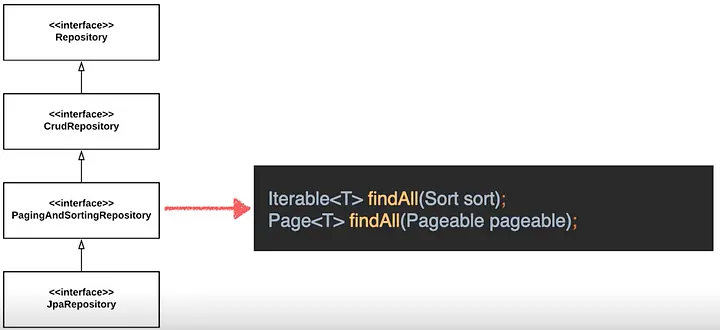

# Introduction To SpringData

**Spring Data JPA** is a popular Java framework that makes it easier to create data access layers in Spring applications. It provides a collection of abstractions and functionalities that allow developers to use the Java Persistence API (JPA) standard to communicate with relational databases.

Here are some significant Spring Data JPA features and concepts:

## 1. Repository Interface

The idea of a repository interface is introduced by Spring Data JPA, which specifies a collection of methods for executing basic database activities. You may create implementation code for `CRUD (Create, Read, Update, Delete)` activities without writing explicit queries by extending certain repository interfaces.

## 2. Entity Class

An entity class is a database table representation. It is annotated with the `@Entity` annotation and often contains fields that correspond to table columns. Spring Data JPA maps entities to database tables and vice versa via reflection and metadata.

## 3. Repository Implementations

Spring Data JPA includes default implementations for common repository interfaces including `CrudRepository`, `PagingAndSortingRepository`, and `JpaRepository`. These implementations provide standard database operations such as `save, remove, findById, findAll`, and others.

## 4. Query Methods

Following a specified naming pattern, Spring Data JPA allows you to build custom query methods in the repository interface. Spring Data JPA can construct the proper SQL query depending on the method signature by analysing the method name. In many circumstances, this eliminates the need to write explicit SQL queries.

## 5. Query Creation from Method Names

Spring Data JPA may construct queries automatically by parsing method names. A method called findByFirstName(String firstName), for example, will construct a query to find entities by their first name. You can also use keywords like `And, Or, Between, GreaterThan, OrderBy`, and more to refine the generated queries.

**For example,** 

```java
@Repository
public interface UserRepository extends JpaRepository<User, Long> {
    List<User> findByFirstName(String firstName);
}
```
Let's understand how this works

findByFirstName function The method is a query method that returns a list of User objects with the firstName value supplied. Spring Data constructs a JPA query behind the scenes based on the method and entity property names, which is equal to the following JPQL query:

```roomsql
SELECT u FROM User u WHERE u.firstName = :firstName
```
The firstName the parameter is bound to the method argument with the same name (firstName in this case), and the method returns a list of User objects that match the query criteria.

> DSL Domain Specific Language is a customized extension of a software programming language that addresses as specific business or domain.

Query DSL is equivalent to
  - Method Contracts
  - Which can begin with `findBy` `queryBy`, `readBy`, `countBy`, and `getBy`
  - Uses JPA attribute names for criteria
  - Multiple criteria combined with ["And", "Or"]

<div align="center">

</div>

###  Query DSL Return Types
```
List<User> findByFirstName(String firstName); // If you want to retrieve multiple results, we can use the List<> 

User findByFirstNameContains(String firstName); // If you want to retrieve a single result, we can use the just the Entity i.e., User

Long findByFirstName(String firstName); // If you want to fetch the number of entities(count) that match the query criteria

```
### Query Processing with AND—OR 

`findByFirstNameAndLastName(String firstName, String lastName)`

_converted JPQL_
```
SELECT e FROM EntityClass e WHERE e.firstName = :firstName AND e.lastName = :lastName
```
_JPQL transformed to the SQL:_
```
SELECT * FROM entity_table WHERE first_name = ? AND last_name = ?
```

### @Query

Spring Data JPA's `@Query` annotation lets you to design bespoke queries for your individual use case, optimize performance, manage complicated queries, and build dynamic queries depending on user input. It gives Spring Data JPA a lot of flexibility and control over how data is obtained from the database.

```java
@Query("select u from User u where u.firstname = :firstname")
List<User> findByFirstname(String firstname);
```

### Modifying Queries

The [@Modifying annotation](https://docs.spring.io/spring-data/jpa/docs/current/api/org/springframework/data/jpa/repository/Modifying.html) extends the @Query annotation, allowing us to run not only SELECT queries, but also INSERT, UPDATE, DELETE, and even DDL queries.

First, let's look at an example of a _@Modifying_ Update Query

```java
@Modifying
@Query("update User u set u.active = false where u.lastLoginDate < :date")
void deactivateUsersNotLoggedInSince(@Param("date") LocalDate date);
```
Here we're deactivating the users that haven't logged in since a given date.

## 6. Paging and Sorting

The `PagingAndSortingRepository` interface in Spring Data JPA supports pagination and sorting. Methods that return `Page` or `Slice` objects allow you to access a subset of data and sort it based on certain criteria.

<div align="center">

</div>

```java
@Repository
public interface ProductRepository extends JpaRepository<Product, Long> { 
    Page<Product> findAllByOrderByPriceDesc(Pageable pageable);
}

Page<Product> products = productRepository.findAllByOrderByPriceDesc(PageRequest.of(1, 10));
```
In the above example, we're going to make a `PageRequest` object with the page number 1 (the second page) and the page size 10. The `findAllByOrderByPriceDesc()` method produces a `Page<Product>` object with the list of goods for the given page as well as information about the overall number of pages and products.

## 7. Native Queries

Spring Data JPA, in addition to query methods, allows you to construct custom queries in native `SQL` or `JPQL (Java Persistence Query Language)`. To conduct more complicated queries, tag repository methods with `@Query` and specify the query string.

```java
@Query("select * from User u where u.firstname =?0", nativeQuery=true)
List<User> findByFirstname(String firstname);
```

## 8. Transactions

Spring Data JPA integrates seamlessly with Spring's transaction management, allowing you to define transactional boundaries around repository methods. By annotating methods with `@Transactional`, you can ensure that database operations are executed within a transactional context.


## Conclusion
Spring Data JPA provides a robust and straightforward solution for Spring applications to interface with databases, minimising boilerplate code and increasing development efficiency. It makes data access layer implementation easier by utilising JPA and offering helpful abstractions for common database operations.