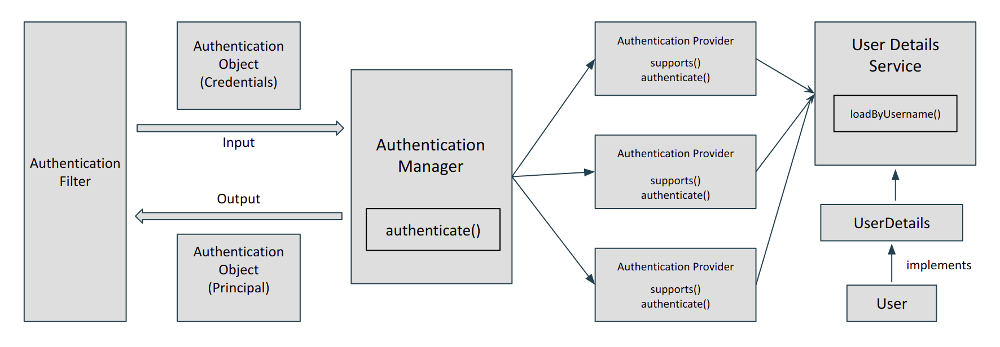

# Spring Security

Spring Security employs a tiered design to provide an all-encompassing security framework for Java applications. Spring Security's architecture is intended to be modular, expandable, and customised. Let's look at the Spring Security architecture's core components and layers:

1. **Security Filters**

   Spring Security is built on a set of Servlet filters that intercept requests and execute security-related activities. These filters handle authentication, authorisation, and other security-related tasks. Among the most essential filters are:

   * **AuthenticationFilter:** Handles authentication requests and authenticates users
   * **AuthorizationFilter:** Enforces access control and authorization restrictions
   * **ExceptionTranslationFilter:** Handles security-related exceptions and handles errors appropriate
   * **Cross-Site Request Forgery (CSRF) Filter** protection is provided by CsrfFilter
   * **LogoutFilter:** Handles logout requests and conducts cleaning duties as needed

2. **Security Context**

   The security context represents an application's current security status. It contains information on the presently authenticated user, their authorities, and other pertinent security information. The security context is held in a `SecurityContextHolder`, which gives the application access to the current security context. Authentication filters often populate the security context during the authentication process.
3. **Authentication**

   Authentication is the process of validating a user's or entity's identification. Spring Security provides support for a variety of authentication techniques, including form-based authentication, HTTP Basic/Digest authentication, OAuth, and others. The **AuthenticationManager** is in charge of authentication. It passes the authentication process to one or more defined **AuthenticationProviders**, which are in charge of authenticating user credentials and creating an **Authentication** object that represents the authorised user.
4. **Authorization**

   Authorization checks whether an authenticated user has the rights required to access a given resource or conduct a specified task. Spring Security has an authorisation mechanism that is both flexible and powerful. It offers RBAC, expression-based access control, method-level security, and other features. The authorization choices are determined based on the user's authorities and the access control rules that have been defined.
5. **User Details and User Stores**
   
   To execute authentication and authorization, Spring Security must retrieve user data such as username, password, roles, and other properties. The **UserDetailsService** interface is in charge of retrieving user information from a user store, such as a database, LDAP server, or in-memory storage. Spring Security provides many **UserDetailsService** implementations for integrating with various user databases.
6. **Security Configurations**
   
   The rules and settings for authentication and authorisation in an application are defined by security configurations. These settings are usually defined in a class that implements **WebSecurityConfigurerAdapter**. Overriding methods to provide authentication providers, access control rules, session management, CSRF protection, and other features allows developers to customise the security setup.

7. **Access Decision Manager**

   The Access Decision Manager is in charge of determining authorization choices based on the application's access control rules. It considers the user's authority as well as the access criteria of the requested resource. To assess whether access should be allowed or refused, the decision manager employs an access control technique such as unanimity, consensus, or positive.

8. **Security Events and Listeners**

   Spring Security provides an event-based mechanism to handle security-related events, such as successful or failed authentication, access denied, and more. Event listeners can be registered to perform additional actions based on these events, such as auditing, logging, or sending notifications.

The Spring Security architecture offers a strong and adaptable framework for safeguarding Java applications. It enables developers to effortlessly integrate authentication, authorisation, and other security elements into their applications while also giving extension and customization options to fit unique needs.