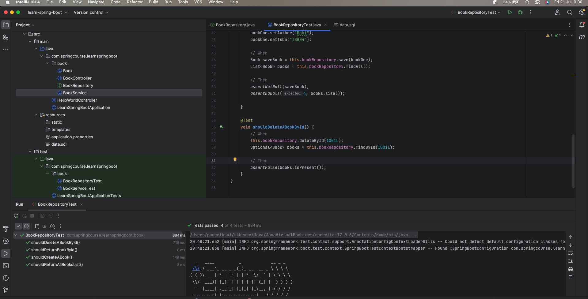
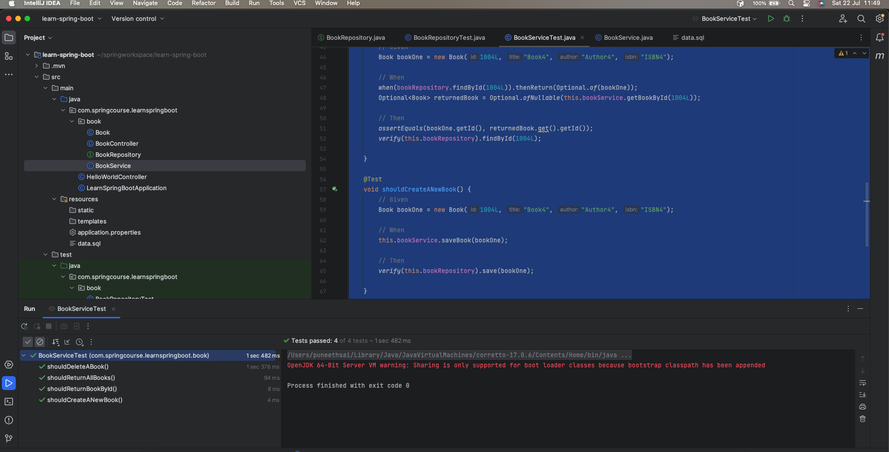
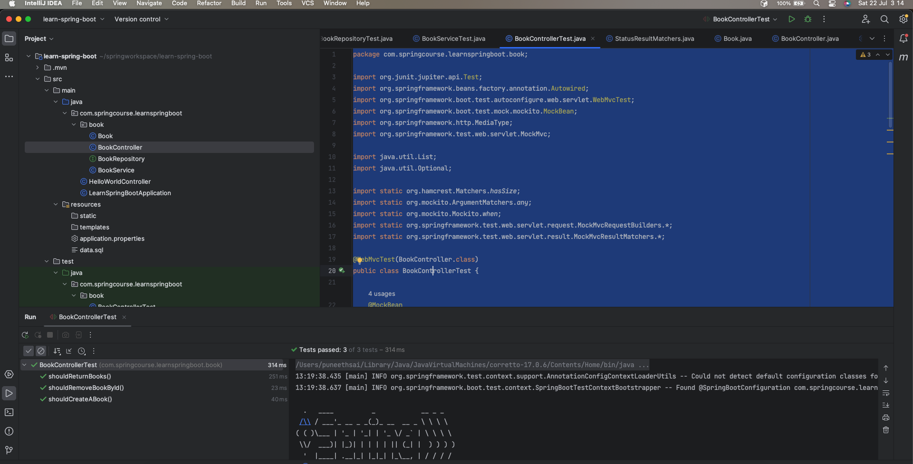

# Unit Testing Rest API using JUnit 5

Now that we've completed the Spring Boot API implementation, let's look at how we can unit test it with JUnit 5 and Mockito.

# Test JPA Repository using @DataJpaTest

Let's start with BookRepository. To improve testing functionality for JPA repositories, Spring Boot includes the `@DataJpaTest` annotation.

By annotating the unit test class with @DataJpaTest, we can instruct Spring to automatically configure JPA repositories.

### Step 1: Create BookRepositoryTest class in the below location /src/test/java/com/springcourse/learnspringboot/book
```java
@DataJpaTest
public class BookRepositoryTest {

    @Autowired
    private BookRepository bookRepository;

}   
```

As we can see, we autowired bookRepository without any further configuration.

By default, @DataJpaTest uses an embedded in-memory database under the hood.

> Please note that with JUnit 5, test classes and test methods are not required to be public.

### Step 2: Now, let’s create a test case for each method:

```java
@DataJpaTest
public class BookRepositoryTest {

    @Autowired
    private BookRepository bookRepository;

    @Test
    void shouldReturnAllBooksList() {
        // When
        List<Book> books = this.bookRepository.findAll();

        // Then
        assertEquals(3, books.size());
    }

    @Test
    void shouldReturnBookById() {
        // When
        Optional<Book> books = this.bookRepository.findById(1001L);

        // Then
        assertTrue(books.isPresent());
    }

    @Test
    void shouldCreateABook() {
        // Given
        Book bookOne = new Book();
        bookOne.setId(1004L);
        bookOne.setTitle("AWS Lambda");
        bookOne.setAuthor("Mahi");
        bookOne.setIsbn("ISBN4");

        // When
        Book saveBook = this.bookRepository.save(bookOne);
        List<Book> books = this.bookRepository.findAll();

        // Then
        assertNotNull(saveBook);
        assertEquals(4, books.size());

    }

    @Test
    void shouldDeleteABookById() {
        // When
        this.bookRepository.deleteById(1001L);
        Optional<Book> books = this.bookRepository.findById(1001L);

        // Then
        assertFalse(books.isPresent());
    }
}
```

As shown above, we used JUnit 5 assertions to verify that everything works as expected for each method. Here is the result screen

### Step 3: **Run the `BookRepositoryTest` class**



# Test Service Layer using Mockito

Next, we are going to test our service BookService. Since it uses BookRepository as a dependency, we will need to mock it first.

Simply put, [Mockito](https://site.mockito.org/) is a powerful mocking framework that takes testing to the next level.

**Fortunately, JUnit 5 comes with a ready-to-use extension model that supports Mockito.**

To enable Mockito integration, we need to annotate our test class with the `@ExtendWith(MockitoExtension.class)` annotation:

### Step 1: Create BookServiceTest in the below location /src/test/java/com/springcourse/learnspringboot/book
```java
@ExtendWith(MockitoExtension.class)
public class BookServiceTest {

    @Mock
    private BookRepository bookRepository;

    @InjectMocks
    private BookService bookService;
}
```

* _**@Mock**_ allows us to create and inject a mock of BookRepository

* **_@InjectMocks_** is used to create an instance of our service BookService so that we can test it

### Step 2: Now, let’s exemplify the use of Mockito and JUnit 5 to test our service:

```java
package com.springcourse.learnspringboot.book;

import org.junit.jupiter.api.Test;
import org.junit.jupiter.api.extension.ExtendWith;
import org.mockito.InjectMocks;
import org.mockito.Mock;
import org.mockito.junit.jupiter.MockitoExtension;

import java.util.List;
import java.util.Optional;

import static org.assertj.core.api.Assertions.assertThat;
import static org.junit.jupiter.api.Assertions.assertEquals;
import static org.mockito.Mockito.verify;
import static org.mockito.Mockito.when;

@ExtendWith(MockitoExtension.class)
public class BookServiceTest {

    @Mock
    private BookRepository bookRepository;

    @InjectMocks
    private BookService bookService;

    @Test
    void shouldReturnAllBooks() {
        // Given
        Book bookOne = new Book(1004L, "Book4", "Author4", "ISBN4");

        // When
        when(bookRepository.findAll()).thenReturn(List.of(bookOne));
        List<Book> books = bookService.getAllBooks();

        // Then
        assertThat(books).hasSize(1);
        verify(this.bookRepository).findAll();

    }

    @Test
    void shouldReturnBookById() {
        // Given
        Book bookOne = new Book(1004L, "Book4", "Author4", "ISBN4");

        // When
        when(bookRepository.findById(1004L)).thenReturn(Optional.of(bookOne));
        Optional<Book> returnedBook = Optional.ofNullable(this.bookService.getBookById(1004L));

        // Then
        assertEquals(bookOne.getId(), returnedBook.get().getId());
        verify(this.bookRepository).findById(1004L);

    }

    @Test
    void shouldCreateANewBook() {
        // Given
        Book bookOne = new Book(1004L, "Book4", "Author4", "ISBN4");

        // When
        this.bookService.saveBook(bookOne);

        // Then
        verify(this.bookRepository).save(bookOne);

    }

    @Test
    void shouldDeleteABook() {
        // When
        this.bookService.deleteBook(1004L);

        // Then
        verify(this.bookRepository).deleteById(1004L);

    }


}
```
We utilised `verify()` in conjunction with JUnit 5 assertions to ensure that employeeRepository methods are correctly triggered when employeeService methods are called.

### Step 3: **Run the `BookServiceTest` class**



# Testing Controller Endpoints

After we've tested the JPA repository and the service layer, it's time to test the Spring controller.

There are numerous approaches to evaluating a rest API. Let us examine each possibility in detail.

## Using @WebMvcTest

**Spring Boot offers @WebMvcTest to focus only on testing Spring MVC web components such as Rest APIs.**

By default, tests annotated with _@WebMvcTest_ will automatically configure [MockMvc](https://docs.spring.io/spring-framework/docs/current/javadoc-api/org/springframework/test/web/servlet/MockMvc.html).

MockMvc, as the name suggests, offers mocking and testing support for Spring web controllers.

## Step 1: So, let’s see how we can use it to test our API or BookController:

```java
@WebMvcTest(BookController.class)
public class BookControllerTest {

    @MockBean
    private BookService bookService;

    @MockBean
    private BookRepository repository;

    @Autowired
    private MockMvc mockMvc;
}
```

As we can see, `@WebMvcTest` lets us specify the controller we want to test.

Please note also that we used `@MockBean` to create a mock of `BookService` and `BookRepository` and add it into the application context.

Now, let’s add a test case for each API’s endpoint:

```java
package com.springcourse.learnspringboot.book;

import org.junit.jupiter.api.Test;
import org.springframework.beans.factory.annotation.Autowired;
import org.springframework.boot.test.autoconfigure.web.servlet.WebMvcTest;
import org.springframework.boot.test.mock.mockito.MockBean;
import org.springframework.http.MediaType;
import org.springframework.test.web.servlet.MockMvc;

import java.util.List;
import java.util.Optional;

import static org.hamcrest.Matchers.hasSize;
import static org.mockito.ArgumentMatchers.any;
import static org.mockito.Mockito.when;
import static org.springframework.test.web.servlet.request.MockMvcRequestBuilders.*;
import static org.springframework.test.web.servlet.result.MockMvcResultMatchers.*;

@WebMvcTest(BookController.class)
public class BookControllerTest {

    @MockBean
    private BookService bookService;

    @MockBean
    private BookRepository repository;

    @Autowired
    private MockMvc mockMvc;
    
    // GET Operation
    @Test
    void shouldReturnBooks() throws Exception {
        Book bookOne = new Book(1004L, "Book4", "Author4", "ISBN4");
        when(bookService.getAllBooks()).thenReturn(List.of(bookOne));
        when(repository.findAll()).thenReturn(List.of(bookOne));

        mockMvc.perform(get("/books"))
                .andExpect(status().isOk())
                .andExpect(jsonPath("$", hasSize(1)))
                .andExpect(jsonPath("$[0].id").value("1004"))
                .andExpect(jsonPath("$[0].title").value("Book4"))
                .andExpect(jsonPath("$[0].author").value("Author4"));

    }

    // POST Operation
    @Test
    void shouldCreateABook() throws Exception {
        Book bookOne = new Book(1004L, "Book4", "Author4", "ISBN4");
        when(bookService.saveBook(any(Book.class))).thenReturn(bookOne);
        when(repository.save(any(Book.class))).thenReturn(bookOne);

        mockMvc.perform(post("/books")
                        .contentType(MediaType.APPLICATION_JSON)
                        .content("{ \"title\": \"Book4\", \"author\": \"Author4\", \"isbn\": \"ISBN4\" }"))
                .andExpect(status().isOk())
                .andExpect(jsonPath("$.title").value("Book4"));
    }

    // DELETE Operation
    @Test
    void shouldRemoveBookById() throws Exception {
        Book bookOne = new Book(1004L, "Book4", "Author4", "ISBN4");
        when(bookService.saveBook(any(Book.class))).thenReturn(bookOne);
        when(repository.save(any(Book.class))).thenReturn(bookOne);
        when(bookService.getBookById(1004L)).thenReturn(bookOne);
        when(repository.findById(1004L)).thenReturn(Optional.of(bookOne));

        mockMvc.perform(delete("/books/{id}", 1004L))
                .andExpect(status().isNoContent());

    }


}
```
> * _**MockMvc**_ comes with the perform() method that we can use to test web request methods such as **GET, POST, PUT, and DELETE**
> * **_andExpect_** allows us to assert the returned HTTP response

### Step 3: **Run the `BookControllerTest` class**



## Conclusion

We covered how to utilise JUnit 5 to unit test Spring Boot rest APIs.

* First, we illustrated how to use `@DataJpaTest` to test the JPA repositories.

* Then, we demonstrated how to use `Mockito` to mimic objects in order to provide testing for business services.

* Finally, we demonstrated how to use `MockMvc` to test API endpoints.
